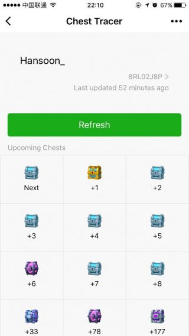
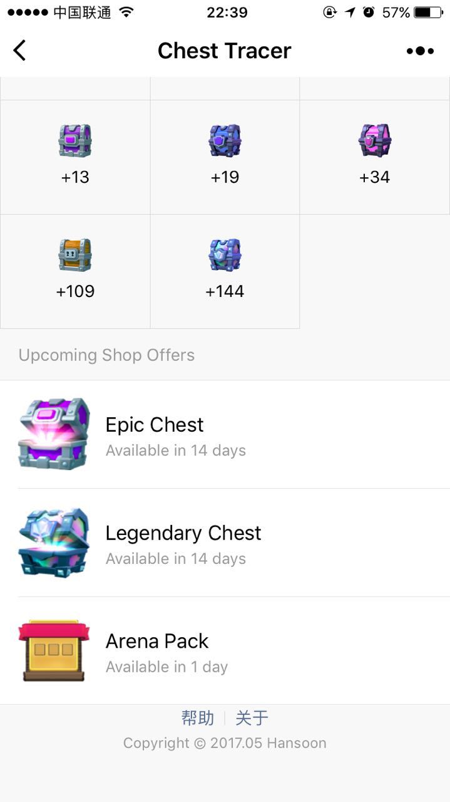

# wx-chest-tracer
### Introduction

This is a WeChat mini program that helps Clash Royale players know which chest is upcoming.

### How to use?

search `ChestTracer` in Mini Program of WeChat App

### Features

- show profile.
- show upcoming chests.
- show upcoming shop offers.
- record history tags.
- no installation, no adds and less mobile phone traffic.

### Update History

#### v1.2.1 (2017.08.12)

- statsroyale page changed, fix it

#### v1.2.0 (2017.07.19)

- new feature: upcoming shop offers
- optimize tips for new users

#### v1.1.3 (2017.06.28)

- optimize tips

#### v1.1.2 (2017.06.19)

- add tag tips
- support tag include # symbol

#### v1.1.1 (2017.06.12)

- some bugs fixed
- auto choose the tag you are using in history tag list
- refresh on pull down

#### v1.1.0 (2017.06.07)

- enhance user experience: make refresh profile and show profile on one click
- optimize page display
- add 'about' page

#### v1.0.3 (2017.06.01)

- support history tags
- fix bug: chest pictures do not show in android phone

#### v1.0.0 (2017.05.22)

- init version

